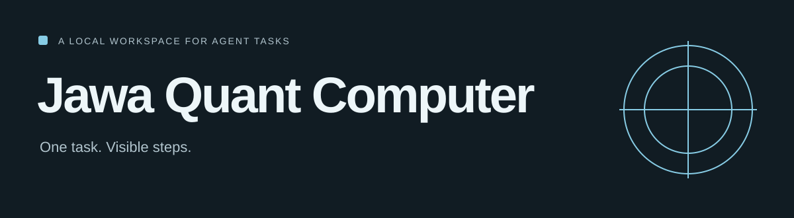

[](https://github.com/honeyamn10-source/jawa-quant-computer/actions/workflows/coverage.yml)



# Jawa Quant Computer

<!-- repo-badges:start -->
<div align="center">

[](https://github.com/honeyamn10-source/jawa-quant-computer/stargazers)
[](https://github.com/honeyamn10-source/jawa-quant-computer/forks)
[](https://github.com/honeyamn10-source/jawa-quant-computer/issues)
[](https://github.com/honeyamn10-source/jawa-quant-computer/commits/main)

[Repository](https://github.com/honeyamn10-source/jawa-quant-computer) · [Issues](https://github.com/honeyamn10-source/jawa-quant-computer/issues) · [Pull Requests](https://github.com/honeyamn10-source/jawa-quant-computer/pulls) · [Actions](https://github.com/honeyamn10-source/jawa-quant-computer/actions)

</div>
<!-- repo-badges:end -->

<!-- professional-meta:start -->
<div align="center">

[](https://github.com/honeyamn10-source/jawa-quant-computer/actions/workflows/ci.yml) [](https://github.com/honeyamn10-source/jawa-quant-computer/actions/workflows/coverage.yml) [](https://github.com/honeyamn10-source/jawa-quant-computer/actions/workflows/release.yml)

   

[Architecture](ARCHITECTURE.md) · [Roadmap](ROADMAP.md) · [Contributing](CONTRIBUTING.md) · [Security](SECURITY.md) · [Demo](demo.gif)

</div>
<!-- professional-meta:end -->


An alpha Python agent workspace with a terminal, a local web interface, tools, scheduling and an activity record.

[Project website](https://honeyamn10-source.github.io/jawa-quant-computer/) · [Build results](https://github.com/honeyamn10-source/jawa-quant-computer/actions)

## What it does

- **Plan and inspect.** Follow tasks through the orchestrator, tool steps and event stream.
- **Use local tools.** Browser, filesystem and shell tools use the configured permission policy.
- **Choose a provider.** Begin in deterministic demo mode, then configure an OpenAI-compatible or Ollama endpoint.

> Alpha software. Demo mode is deterministic; a mock result is not proof of a real browser or model operation. Review permissions before enabling tools on personal data.

## Highlights

- **In-process agent orchestrator** — planner (heuristic for demo mode, LLM/JSON for real
  models), DAG step executor, goal verifier, step retries, max runtime/steps guardrails.
- **Skills** — `browser` (Playwright or deterministic mock driver), `filesystem`,
  `shell`, `git`, `documents`, `memory`, `search`, `research`, `computer`,
  `scheduler` (once / interval / cron schedule math, timezone aware).
- **Scheduling** — one-time and recurring jobs persist to SQLite and fire on time,
  producing new tasks through the same pipeline.
- **Provider adapters** — OpenAI-compatible API, Ollama (native), and a deterministic
  `mock` provider so the whole system works offline with no keys.
- **Security model** — risk-classed actions (`low` / `medium` / `high`) with explicit
  allow / deny / ask approval rules, exact-secret redaction, and an encrypted secret
  vault (OS keyring with a 0600 file fallback).
- **Storage** — SQLite (WAL), row-level migration ledger, repos for tasks, steps,
  event log, approvals, providers, jobs, memories, activity.
- **Interfaces** — FastAPI server with SSE event stream, a vanilla-JS loopback web UI,
  and a rich terminal REPL (`jawa-quant-computer`).
- **Tests** — 50+ hermetic tests (unit, provider integration against in-process mock
  OpenAI/Ollama servers, API via TestClient, end-to-end acceptance flows, security).
  CI matrix across Python 3.11–3.13 and Linux / Windows / macOS.

## Quick start

```bash
python -m venv .venv && source .venv/bin/activate   # Windows: .venv\Scripts\activate
pip install -e ".[dev]"                             # includes web deps + browser

# demo mode — everything works, no keys, no network
jawa-quant-computer                                 # rich terminal REPL

# loopback web UI
uvicorn jqc.api.server:app --host 127.0.0.1 --port 8765
# open http://127.0.0.1:8765
```

For a **real browser model**, install Chromium and point `JQC_BROWSER_DRIVER=playwright`:

```bash
python -m playwright install --with-deps chromium
JQC_BROWSER_DRIVER=playwright jawa-quant-computer
```

For **real LLM** providers, register one from the UI or CLI. OpenAI-compatible and
Ollama endpoints are supported; API keys are stored encrypted in the OS keyring.

## The acceptance flows

The three flows that define the P0 slice are tested end to end in
`tests/test_e2e_flows.py` and verified live by `scripts/smoke.py`:

1. **Browser → file** — open `https://example.com`, capture the page title, save it
   into a text file.
2. **Folder → file → read-back** — create a folder, write `notes.txt` inside it,
   read it back.
3. **Scheduler** — schedule a one-time job a few minutes in the future; the scheduler
   fires it and the job creates its file.

```bash
python scripts/smoke.py        # demo mode, deterministic, no keys or network
```

## Configuration

Settings are read from environment variables (prefix `JQC_`) or a local `.env` file.
See `.env.example` for the full list. Key ones:

| Variable | Default | Meaning |
| --- | --- | --- |
| `JQC_DATA_DIR` | `./jqc-data` | SQLite, vault, logs |
| `JQC_WORKSPACE_DIR` | `./jqc-workspace` | Root the agent may freely read/write |
| `JQC_BROWSER_DRIVER` | auto | `mock`, `playwright`, or unset (auto-detect) |
| `JQC_DEMO_MODE` | `true` | Fall back to mock provider |
| `JQC_APPROVAL_MODE` | `prompt` | `prompt` / `auto` (alien mode) |
| `JQC_BROWSER_HEADLESS` | `true` | Run Chromium headless |
| `JQC_MAX_RUNTIME_SECONDS` | `600` | Per-task wall-clock budget |
| `JQC_MAX_STEPS_PER_TASK` | `20` | Per-task step budget |

## Documentation

- [ARCHITECTURE.md](ARCHITECTURE.md) — modules, data flow, security model.
- [docs/decisions](docs/decisions) — architecture decision records.
- [SECURITY.md](SECURITY.md) — threat model, permissions, vault, redaction policy.
- [CONTRIBUTING.md](CONTRIBUTING.md) — workflow, test/CI commands.
- [CHANGELOG.md](CHANGELOG.md) — releases.
- [ROADMAP.md](ROADMAP.md) — near-term targets.

## Development

```bash
pip install -e ".[dev]"
ruff check src tests
pytest
```

## License

MIT — see [LICENSE](LICENSE).
## Coverage report

The coverage badge shows whether the coverage workflow passes. Open its latest successful run and download `coverage-report` for measured line coverage and uncovered lines. The badge is a workflow status, not a claimed percentage.
